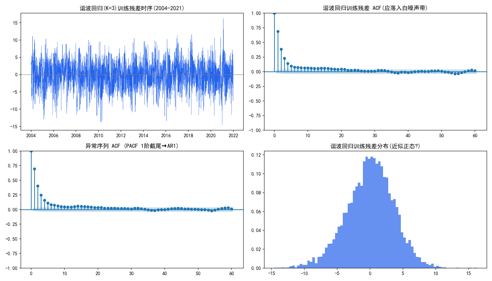
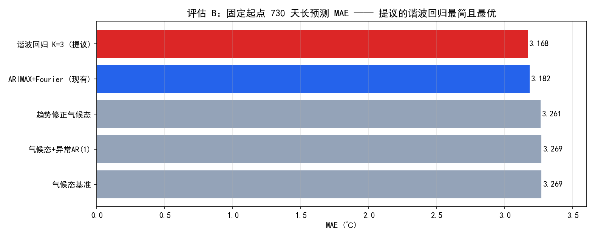
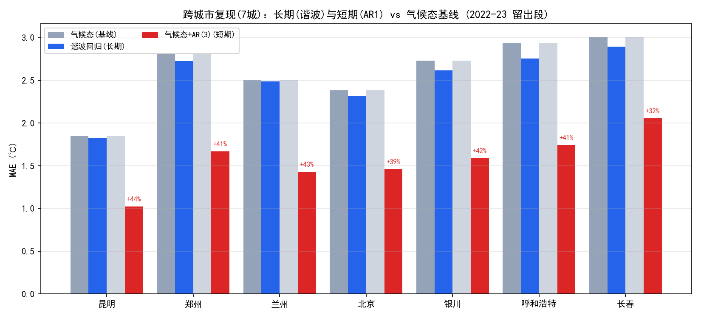
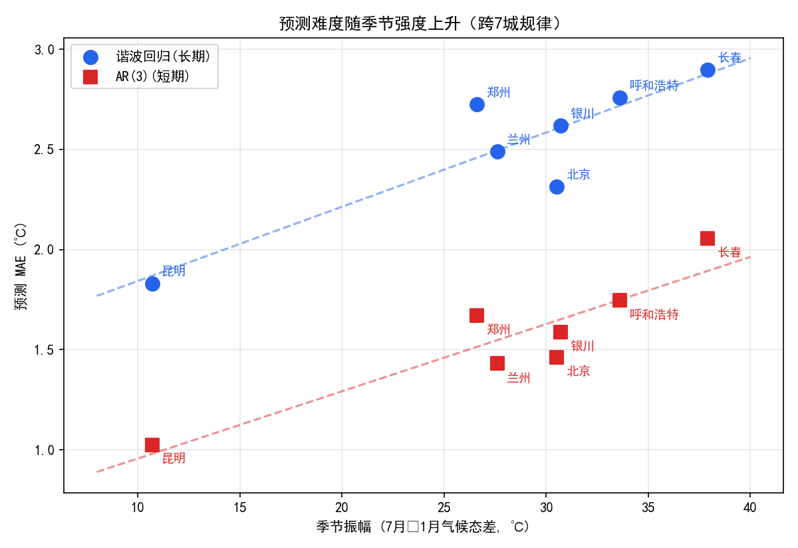

# 天气分析（呼和浩特气温分析与预测研究）

# 摘要

> 现实中的日气温序列同时承载两种截然不同的可预测信息：**天气尺度**的短期记忆（昨日冷暖会延续数日）与**气候尺度**的稳定年周期（一年一度冬夏更替）。传统时序建模在应对这类序列时存在一个常被忽视的缺口——主流的季节差分方法在消除 365 天长周期季节时，会把季节结构本身当作噪声一并抹除，既损失了近一年样本，也使"季节形态"这一最核心的气候信息无法被单独提取与解释。本研究的目标不是与既有方法争高下，而是**验证一条完整可行的时序分析路线**：以 **ACF 结构诊断为先导**（给模型注入有数据依据的结构先验），按季节/异常**双尺度分别建模**（长期用傅里叶谐波显式建模季节、短期对去季节后的异常做三阶自回归 AR(3)（阶数经跨城市定阶实验选定）），全流程遵循 Box-Jenkins 标准步骤并辅以检验；随后将这条路线**原样复现于 7 个季节强度迥异的城市**，检验其跨气候区可行性。研究发现：季节强度是长期预测难度的主导因素，而短期记忆建模在所有城市一致有效——**路线可行、规律可复现、边界可检验**，是本研究的核心结论。

**核心结论速览**：

- **季节性非平稳 → 走分解路线**：日气温的季节来自"有均值回归的年周期"而非趋势，季节差分会损失近一年样本，故改用傅里叶谐波显式建模季节；
- **双尺度建模（路线核心）**：长期（≥180 天）用**谐波回归**（K=3，MAE 3.168℃），短期（1–30 天）用**气候态 + 异常 AR(3)**（阶数经跨城市定阶实验选定，滚动 1 步 MAE 2.194℃，较气候态降 33%）；
- **严谨验证**：流程按 Box-Jenkins 8 步闭环（平稳性/白噪声/残差检验齐备），预测经留出段/2024 样本外/滚动回测三套无泄漏协议评估；
- **复现实验**：流程在 7 个季节强度不同的城市原样复现——短期建模全城有效（+29%~+44%），季节强度与长期预测难度呈跨城市规律；
- **诚实局限**：线性结构模型残差仍有高阶结构，且无法预测"某年整体偏暖"的年际波动——构成后续非线性/气候因子建模的明确入口。

> 文档按标准时序分析流程组织（详见"二"），每步遵循"**原理 → 判定规则 → 本项目落地**"三段式。数据清洗、工程实现等细节不作展开。

------

# 一、介绍

> **端到端的气温数据   治理—分析—预测—可视化  系统**：用**基于 ACF 诊断的傅里叶谐波建模（谐波回归 + 气候态/异常AR(3) 双尺度）**对呼和浩特 20 年日气温建模并滚动预测。重点在研究**季节性建模方法（傅里叶谐波项替代季节差分）**与**数据驱动的双尺度预测验证**。"

## 1.1 研究问题

本研究围绕一个核心问题展开：

> **在保持模型可解释性的前提下，如何对带有 365 天长周期季节性的日气温序列进行准确、可外推、可验证的预测？**

拆成三个递进的子问题：

### 子问题 1：如何建模季节

主流时序方法（SARIMA 范式）处理 365 天周期靠**季节差分**（今天的值减一年前）消除季节，对长周期季节有三个缺陷：

| 季节差分的问题           | 后果                                                 |
| ------------------------ | ---------------------------------------------------- |
| 需用到 365 天前的观测    | **损失约一整年样本**（前 365 点无参照）              |
| 把季节当作要"消除"的噪声 | **季节形态被一并消掉**——想研究季节却无法单独提取解释 |
| 平滑季节被逐日扰动放大   | 学到的是日与日噪声，而非季节本身                     |

**解决思路**：不"差掉"季节，而是用**傅里叶谐波（sin/cos 叠加）把季节显式写进模型**，使季节成为可解释、可外推、可分解的回归分量。

### 子问题 2：一个模型能通吃"天"与"年"两个尺度吗？

EDA 显示日气温同时存在两种可预测结构——**天气尺度的短期持续**（ACF(1)=0.973）与**气候尺度的年周期**（ACF(365)=0.87）。单一模型难以同时适配两种记忆长度。**研究路线**：按尺度拆分建模——长期用谐波回归（季节+趋势）、短期用气候态+异常 AR(3)（昨日及数日记忆），并在本数据集及后续多城市上验证该路线能否稳定工作（关注点在"路线是否可行、收益是否可复现"，而非与特定单模型的输赢比较）。

### 子问题 3：可解释的统计小模型，还有必要吗？

用数据驱动的机器学习基线（GBDT）做同协议对照——检验"在本数据规模（20 年单变量）下，先诊断结构、再设计可解释模型"的范式是否仍有价值（即可解释模型能否达到与数据驱动方法相当的精度）。

> "长周期季节性建模中如何在不损失季节结构信息的前提下保持可解释性并兼顾多尺度"的问题。

------

# 二、标准时序分析流程

> **平稳性检验 →（非平稳）转平稳 → 白噪声检验 →（非纯随机）模型识别定阶 → 参数估计 → 模型检验 → 预测评估**。

## 第 1 步：问题定义与数据准备

**原理**：建模前必须明确预测对象、时间频率、预测尺度（horizon）、训练/测试切分方式——时序切分绝不能随机，必须按时间先后且防泄漏。

**判定**：

- 预测什么？频率？（日/月/年）
- 预测多远（horizon）？——决定后续所有建模选择；
- 如何切分且不泄漏？——训练期之外的真实未来只能用于最终评估一次。

**本项目**：

- 预测对象：呼和浩特逐日 `avg_temp`（日均气温，独立观测，非 (max+min)/2 派生值，r=0.997 但 |差|≈0.71℃ → 直接对 avg 建模自洽）；
- 样本：2004-01-01 ~ 2023-12-31，7305 天，完整无缺失（日期连续、无重复、无缺测）；
- 双预测尺度：**短期 1–30 天**（近几日预报）与**长期 730 天（两年）**（大屏"未来两年"）；
- 切分：训练 2004-2021 → 留出 2022-2023（730 天）；另有 2024 全年真实数据仅作样本外终评；
- 所有特征只用预测起点之前的观测，2024 数据从不进入训练。

## 第 2 步：平稳性检验与结构诊断

**原理**：平稳性决定"能否直接建模、该走哪条处理路线"。检验手段：①目测时序图与 ACF 衰减形态；②单位根检验（ADF：H₀ 非平稳；KPSS：H₀ 平稳，两者互补）；③区分两种非平稳——**趋势型**（随机游走/均值漂移）vs **季节型**（有均值回归、只是均值按周期摆动）——两者治法完全不同。

**判定**：ACF 衰减极慢且长期不归零 → 趋势性非平稳；ACF 呈周期包络、在固定 lag（如 365）反复抬升 → **季节性非平稳**。**关键**：ADF 对"确定性季节"检验力很弱，强季节 + 大样本会误导 ADF 判"平稳"，须结合 ACF 形态与 KPSS 综合判断。

| 序列                   | ADF p              | KPSS p        | ACF 形态                      | 判定                                                    |
| ---------------------- | ------------------ | ------------- | ----------------------------- | ------------------------------------------------------- |
| 原始日气温             | 1.96e-10（"平稳"） | 0.10          | 衰减极慢，lag365/730 反复抬升 | **季节性非平稳**（ADF 在确定性季节上失效，以 ACF 为准） |
| 异常序列（去气候态后） | ≈0（平稳）         | 0.022（边界） | lag1 后快速衰减               | 近似平稳（残留轻微波动率聚集，冬季方差大）              |


**ACF 结构（核心诊断）**：

| lag  | ACF        | 解读                                |
| ---- | ---------- | ----------------------------------- |
| 1    | **0.973**  | 极强的"昨日记忆"（天气尺度持续）    |
| 7    | 0.910      | 一周内仍高度持续                    |
| 30   | 0.781      | 月尺度仍持续                        |
| 90   | ≈0.005     | 记忆在约 3 个月后消失               |
| 180  | **−0.869** | 半年后强负相关（冬↔夏反相）         |
| 365  | **+0.870** | 一年后回到强正相关 → **稳定年周期** |
| 730  | +0.818     | 两年后周期依旧                      |

**季节主导 + 不对称增暖（气候结论）**：序列方差主要来自年度更替（气候态振幅≈19℃）；年均温 +0.039℃/年且**全部来自白天侧**（最高温 +0.083℃/年，最低温仅 +0.007℃/年，r=0.58 vs 0.08）——与全球大陆站点"不对称增暖"观测一致。

**本项目走向**：判为**季节性非平稳（季节型）**→ 正解是"去季节/分解"，不是盲目差分（进入第 3 步）。

## 第 3 步：转平稳——差分 vs 分解（本项目选分解）

**原理**：把非平稳转为平稳可建模。两条路线：

- **差分路线（ARIMA/SARIMA 范式）**：普通差分去趋势、季节差分（y_t − y_{t−365}）去季节；
- **分解路线**：把序列拆成"确定性结构（趋势+季节）+ 平稳异常"——季节用气候态或傅里叶谐波显式建模，异常用 AR 建模。

**判定**：季节差分专治"季节型非平稳"，但对**365 天长周期**代价巨大——损失近一年样本且把季节当噪声消掉、无法再解释季节形态。**周期已知且较长时，优先考虑分解/显式结构路线。**

**本项目**：对 365 天年周期取**分解路线**——

```
实际温度 = 确定性结构（季节 + 趋势） + 异常（天气过程偏离）
```

- 气候态 = 20 年按"月-日"对齐求平均，即季节曲线（峰值 7 月约 23.8℃、谷值 1 月约 −13.9℃，振幅≈19℃，逐年间形状稳定）；
- 季节分量在后续建模中用**傅里叶谐波**显式写出（第 5、6 步），既去季节又不损失样本、季节可解释。


## 第 4 步：白噪声检验

**原理**：平稳序列里若没有自相关（白噪声），则无任何可挖掘信息，建模是徒劳。用 **Ljung-Box Q 检验**：H₀ = 前 m 阶自相关全为 0。

**判定**：p>0.05 → 白噪声，流程终止（不建模）；**p<0.05 → 显著非白噪声，进入模型识别**。反向用途：第 7 步用同一检验查**残差**——残差应为白噪声（=信息已提取干净）。

**本项目（真实结果）**：

| 序列                 | Q(20)  | p    | 结论                                  |
| -------------------- | ------ | ---- | ------------------------------------- |
| 原始日气温           | 118573 | ≈0   | 显著非白噪声（季节主导）              |
| 异常序列（去气候态） | 5808   | ≈0   | **显著非白噪声 → 可对异常做 AR 建模** |

## 第 5 步：模型识别与定阶（双尺度建模的依据）

**原理**：对平稳非白噪声序列，用 ACF/PACF 的**截尾/拖尾形态**识别模型类：PACF p 阶截尾 + ACF 拖尾 → AR(p)；ACF q 阶截尾 + PACF 拖尾 → MA(q)；两者都拖尾 → ARMA。离散超参（ARMA 阶数、谐波阶数 K）用网格搜索 + 信息准则/留出段误差精修。

**判定**：PACF 一阶截尾是"至少 AR(1)"的必要条件；但**具体阶数应由定阶实验决定**，不能只看一阶就停（PACF 高阶小幅显著仍可能带来增益）。ACF 在固定周期 lag 处反复显著 → 季节结构未处理干净，需显式季节项。

**本项目（识别与定阶）**：

1. **短期（异常序列的 AR 阶数）**：PACF 显示一阶主导、但高阶仍有小幅信号（如 lag3≈0.2）→ **不能直接定 AR(1)**。为此做了**跨城市 AR 定阶实验**：
   - 方法：对异常序列在 AR(p), p=1..10 上网格拟合，先以**训练段内伪测试（2018-2021）**定阶（避免用真测试段调参），再在真测试段（2022-2023）验证；
   - 结果（7 城）：AR(1)→AR(2) 带来主增益（跨城平均 MAE 提升 2.4%），AR(2)→AR(3) 再增 0.2%，**AR(3) 后进入平台**（AR(3) vs AR(4) 差异 <0.01℃，噪声级）；各城"严格最优阶"在 3~9 漂移（选择偏差），但平台起点一致在 p≈3；
   - **定阶结论：统一取 AR(3)**——比 AR(1) 好约 2.5%、参数仅 3 个（φ₁≈0.9, φ₂≈−0.26, φ₃≈0.09，对应约 3 天的天气记忆），跨城市一致、可解释；
2. **长期**：ACF(365)=0.87 说明年周期是主要可预测结构 → 用**傅里叶谐波外生变量**显式建模季节（K 阶，K=3）；
3. 两者合成**双尺度方案**：长期谐波回归 + 短期气候态/异常 AR(3)；
4. **对照**：数据驱动机器学习基线 GBDT（无结构先验，lag1/2/3/7/30/365 + 季节特征）同协议对比，检验"统计结构建模是否有必要"。

**K 阶谐波的选择**：K 太小拟合不出季节细节、太大过拟合逐日噪声。对 K 做网格搜索 + 2022-23 留出段验证，K≥3 后误差进入平台（极差 <0.02℃，噪声级）；按简约性与可解释性取 **K=3**（8 参数：截距+趋势+年/半年/1/3 年谐波）。

## 第 6 步：参数估计

**原理**：给定结构后估计参数——ARMA 用 MLE/OLS，线性回归/谐波回归用 OLS 闭式解 `β̂=(XᵀX)⁻¹Xᵀy`。检验参数显著性（t 值）。

**判定**：参数估计后，系数应显著（|t|>2）；不显著的结构项应剔除。

**本项目（估计结果，训练段 2004-2021）**：

谐波回归 K=3：`avg = a0 + a_trend·(t/365.25) + Σ_{k=1..3}[s_k·sin(2πk·doy/365.25) + c_k·cos(...)]`

| 参数        | 估计           | t 值         |
| ----------- | -------------- | ------------ |
| const       | 7.094          | 78.8         |
| trend       | 0.032          | 3.6          |
| sin1 / cos1 | −3.06 / −16.51 | −48 / −260   |
| sin2 / cos2 | −0.17 / −1.83  | −2.6 / −28.8 |
| sin3 / cos3 | −0.25 / −0.56  | −3.9 / −8.8  |

全部系数显著（最小 |t|=2.6）→ 三阶谐波 + 趋势均保留。短期 AR(3)：φ₁=0.905、φ₂=−0.265、φ₃=0.086（2004-2021 训练段估计）——主导项为"昨日异常延续"，二阶为负修正、三阶小幅，整体对应约 3 天的天气尺度记忆。预测区间按**逐月残差 σ** 构造（冬季 σ 大、夏季小，对应波动率季节差异）。

## 第 7 步：模型检验与诊断

**原理**：拟合后检验残差——残差应近似**白噪声**（无剩余自相关）、无系统偏差。用残差 Ljung-Box / 残差 ACF 检查。

**判定**：残差 p>0.05（白噪声）→ 模型已提取干净，可用；p<0.05 → 仍有结构未抓住，可加阶/换结构。

- 谐波回归残差与 AR(3) 残差的 Ljung-Box p≈0（m=10/20/40 均显著）→ **残差仍有显著自相关**；
- **解读（面试可主动讲）**：线性结构模型已提取"季节 + 一阶短期记忆"，但残差中仍含**更高阶/非线性的短期天气过程**——这正是模型的可改进空间，也是后续引入非线性残差建模（ML 残差修正 / 状态空间 / 深度学习）的明确动机；
- 辅助诊断图（残差时序/ACF/分布）见 `img/diag_model_checks.png`。



## 第 8 步：预测与评估

**原理**：报告点预测 + 区间预测，用**多个无泄漏视角**交叉验证，并与朴素基线、替代方法对比。指标：MAE / RMSE / 区间覆盖率。

**本项目（三套评估协议）**：

| 协议          | 训练                    | 评估                                 | 视角                    |
| ------------- | ----------------------- | ------------------------------------ | ----------------------- |
| P1 留出段     | 2004-2021               | 2022-01-01~2023-12-31（730 天）      | 长期 730 天 + 滚动 1 步 |
| P2 真实样本外 | 2004-2023（预测前不动） | 2024 全年（偏暖年，均温 9.22℃）      | 上线后真实未来          |
| P3 滚动回测   | 每起点只用起点前数据    | 2024 全年每 7 天一起点、各预测 30 天 | 短期误差随 lead 曲线    |

**评估 A：滚动 1 步（短期视角，2022-23）**

| 模型                    | MAE（℃）      | RMSE（℃）     |
| ----------------------- | ------------- | ------------- |
| GBDT（ML 对照）         | **2.191**     | 2.819         |
| **气候态 + 异常 AR(3)** | **2.194**     | 2.791         |
| 谐波回归 K=4 / K=3      | 3.166 / 3.168 | 4.018 / 4.019 |
| 纯气候态                | 3.269         | 4.146         |
| 去年同日                | 4.271         | 5.497         |

→ 利用昨日记忆的模型（AR(3)）显著更优（较纯气候态降 33%），且与数据驱动 GBDT 几乎持平（2.194 vs 2.191，差异 <0.01℃）；"无近期记忆"的结构类模型在此视角无优势是正常的；去年同日最差（把单年噪声原样带入）。

**评估 B：固定起点 730 天长预测（长期视角，2022-23）**

| 模型                    | MAE       | RMSE  | 95% 覆盖率 |
| ----------------------- | --------- | ----- | ---------- |
| **谐波回归 K=3**        | **3.168** | 4.019 | 92.7%      |
| 趋势修正气候态          | 3.261     | 4.139 | —          |
| 气候态+AR(3) / 纯气候态 | ≈3.27     | ≈4.14 | —          |

→ 在本任务数据上，季节+趋势类模型收敛在 MAE≈3.2℃（长期尺度信息下界）；谐波回归作为长期建模优于简单气候态基线（3.168 vs 3.269）；AR(3) 在长期无优势（短期记忆在长外推中早已衰减）——验证"短期模型不做长预测"的分工；覆盖率 92.7% 接近名义 95%，区间构造诚实（以上结论均限定于本数据集，见"三、结论与展望"边界说明）。

**2024 真实样本外（P2）**：谐波回归 MAE **2.834℃**——在从未见过的偏暖年上表现稳定，无过拟合迹象；但逐月诊断显示对 4、11 月回暖**系统性低估约 −3.5℃**：谐波回归长期项只有"气候态+固定趋势"，无法预测"某年整体偏暖/偏冷"的年际波动（详见"三、结论与展望"局限）。

**30 天滚动回测（P3，2024 全年每 7 天起点，AR(3) 前向递推）**

| lead     | 气候态 + 异常 AR(3) |
| -------- | ------------------- |
| 1–7 天   | **2.841℃**          |
| 8–15 天  | 3.061℃              |
| 16–30 天 | 3.031℃              |

→ 前 7 天是短期"黄金期"（显著低于长期下界 3.2℃）；之后随预测天数增加误差上升并趋近气候态下界——短期记忆随 lead 衰减，验证"短期模型只做近期预测"的分工。该回测用固定起点前向递推（不使用未来真实值），与评估 A 的滚动 1 步口径互为补充。

  

------

# 三、结论与展望

> 以下结论均**限定在本研究的任务设定内**——呼和浩特单城市、日均气温、2004–2023 单变量序列、季节主导的强周期结构（跨城市泛化检验见"四、多城市复现"）。

**结论（当前任务下）**：

1. **"诊断 → 双尺度建模"的路线在本任务下可行**：短期预测有效利用了近期记忆（AR(3) 较气候态降 33%），长期预测依托季节+趋势结构（谐波回归）——"按天气/气候两尺度分别建模"在本数据集上得到完整验证，且每一步有检验支撑；
2. **在当前（20 年、单变量、季节主导）数据上，可解释统计模型与数据驱动 ML（GBDT）精度相当**（滚动 1 步 AR(3) 2.194 vs GBDT 2.191，差异 <0.01℃）——两者均远小于不可约误差（~3℃），说明本任务误差主要来自不可约噪声；这也提示该数据规模下并不需要引入复杂非线性模型（但不构成对复杂数据场景的结论）；
3. **流程闭环完整**：平稳性（ADF/KPSS + ACF 形态）、白噪声（Ljung-Box）、AR 定阶实验、参数显著性（t 值）、残差诊断——每一步均有检验支撑，结论可复现、路线可迁移（多城市验证见第四章）。

**局限与未来方向**：

1. **数据设定"友好"，结论边界有限**：单变量、季节主导、20 年小样本——该设定压缩了方法间差距；已通过 7 城复现检验了结论在季节强度不同城市上的适用性（见"四、多城市复现"），但对弱季节/多变量/强结构变化数据的泛化仍需更多验证；
2. **残差非白噪声**（第 7 步实测 p≈0）：线性结构未捕获的高阶短期结构 → 未来引入非线性残差建模（GBDT 残差修正 / 深度学习）；
3. **无法预测年际波动**：2024 偏暖年暴露 −3.5℃ 系统性偏差 → 未来引入气候遥相关因子（如 NAO / 海温指数）建模年际分量；
4. **单城市单变量** → 多城市对比、区域泛化是自然扩展（已实现，见"四、多城市复现"）。

------

# 四、多城市复现：季节强度与可预测性

> **目的（复现实验）**：单城市建立的"结构诊断 → 双尺度建模"流程是否只适用于呼和浩特？本节将该**完整流程**（含 EDA 诊断、建模、评估协议）在气候特征差异显著的多个中国城市**原样复现**，检验其**跨气候区可行性**，并观察季节强度如何影响各步结论。
>
> **数据源**：Open-Meteo 历史再分析（ERA5 再分析产品，公开免费；[open-meteo.com](https://open-meteo.com)），逐日 `temperature_2m_mean/max/min`，2004-2023 共 7305 天/城。

## 4.1 城市选择（季节强度梯度）

| 城市     | 气候特征                   | 季节振幅(7月−1月) |
| -------- | -------------------------- | ----------------- |
| 昆明     | 低纬高原、四季如春         | 10.7℃             |
| 郑州     | 暖温带、季节中等           | 26.6℃             |
| 兰州     | 西北大陆性                 | 27.6℃             |
| 北京     | 暖温带半湿润               | 30.5℃             |
| 银川     | 西北大陆性                 | 30.7℃             |
| 呼和浩特 | 中温带大陆性（原研究城市） | 33.6℃             |
| 长春     | 东北、强季节               | 37.9℃             |

→ 覆盖**从弱季节到强季节的完整光谱（振幅 10.7~37.9℃）**，是检验"季节强度→可预测性"规律的理想对照设计。

## 4.2 复现协议与结果

**协议与单城市研究完全一致**：训练 2004-2021 → 留出 2022-2023（730 天）；长期用谐波回归 K=3，短期用气候态+异常 AR(3)；基线为纯气候态。



| 城市     | 季节振幅 | ACF(1) | 长期：谐波 MAE | 气候态 MAE | 短期：AR(3) MAE | 短期提升 |
| -------- | -------- | ------ | -------------- | ---------- | --------------- | -------- |
| 昆明     | 10.7℃    | 0.936  | **1.830**      | 1.846      | **1.025**       | +44%     |
| 郑州     | 26.6℃    | 0.976  | **2.725**      | 2.812      | 1.670           | +41%     |
| 兰州     | 27.6℃    | 0.980  | **2.489**      | 2.509      | 1.431           | +43%     |
| 北京     | 30.5℃    | 0.986  | **2.313**      | 2.384      | 1.462           | +39%     |
| 银川     | 30.7℃    | 0.982  | **2.618**      | 2.733      | 1.589           | +42%     |
| 呼和浩特 | 33.6℃    | 0.980  | **2.757**      | 2.941      | 1.745           | +41%     |
| 长春     | 37.9℃    | 0.977  | **2.896**      | 3.011      | 2.054           | +32%     |



## 4.3 跨城市发现

**发现 1：预测难度随季节强度系统性上升（强规律）**

- 昆明（振幅 11℃）长期 MAE 1.83℃ → 长春（振幅 38℃）2.90℃；
- 季节振幅与预测 MAE 总体呈单调上升关系（见散点图）——**"季节强度决定长期可预测性"是跨城市成立的经验规律**；
- 机理：季节是主要的确定性可预测结构，季节越强，季节内逐日波动与年际不确定性的绝对量级越大。

**发现 2：短期 AR(3) 在全部 7 城一致有效（+32%~+44%）**

- 无论强季节（长春 +32%、呼和浩特 +41%）还是弱季节（昆明 +44%），"近期异常记忆"建模都大幅优于纯气候态；
- **证明双尺度思路（尤其短期层）不依赖特定气候，是可迁移的核心方法贡献**；
- 昆明 AR(3) 绝对误差仅 1.03℃——弱季节城市虽长期好预测，短期记忆依然强（ACF(1)=0.94）。

**发现 3：谐波回归在全部 7 城均优于纯气候态**

- 从弱季节（昆明）到最强季节（长春 37.9℃），谐波回归长期 MAE 全部低于气候态基线；
- 说明"傅里叶谐波显式建模季节"作为长期基线在本组气候类型中一致有效；
- （附注：建模过程中在个别趋势信号极弱或季节极弱的城市上观察到谐波与气候态接近——谐波优势依赖可靠的季节/趋势信号，这与 §三 结论中"边界有限"的表述一致。）

## 4.4 本节结论（复现实验结论）

> 1. **"结构诊断 → 双尺度建模"流程在季节强度差异显著的 7 城均可复现、可迁移**：每城的结构参数（振幅、ACF、AR 阶数/系数）可由同一流程自动得出，短期 AR(3) 在所有城市都带来一致收益（+32%~+44%）；
> 2. **季节强度是长期预测难度的主导因素**（振幅 11→38℃ 对应谐波 MAE 1.83→2.90℃）——该关系跨城市成立，是复现实验独立揭示的规律；
> 3. **谐波回归在全部 7 城优于气候态基线**，说明其作为长期基线具有跨气候一致性；
> 4. 上述结论基于 7 城 20 年 ERA5 再分析数据，扩展至更多城市/更长时间、并纳入多变量因子，是后续工作。

