# 天气分析（呼和浩特气温分析与预测研究）

# 摘要

> 本研究围绕 **呼和浩特市 2004–2023 年（7305 天）逐日气温序列**，从"数据治理 → 结构诊断 → 双尺度建模 → 无泄漏验证 → 可视化落地"。核心问题：**如何为一条同时含"天气尺度短期记忆"与"气候尺度年周期"的双结构时间序列，设计可解释、可外推、可验证的预测方法？**

**流程总览（五个环节）：**

1. **数据治理与多维统计（statistic 模块）** —— 原始数据经清洗（业务规则 + 1.5×IQR 离群剔除）进入三层数仓：ODS（原始明细）→ DWD（清洗+特征：日较差、季节）→ ADS（年/月趋势、极端天气、日较差分布、KPI 等主题统计表），使建模与可视化同源取数、口径一致。
2. **探索性数据分析 EDA（forecast/experiments）** —— 对序列做八步诊断：完整性、描述统计、长期趋势、气候态季节形态、自相关结构、变量关系、日较差稳定性、年×月互证。得到三条决定性发现：**季节是最大方差来源（振幅≈19℃）**、**ACF(1)=0.973 的强短期持续**、**ACF(365)=0.87 的稳定年周期**，并识别出"最高温增暖快于最低温"的不对称趋势（+0.083 vs +0.007 ℃/年）。
3. **寻找合适模型（forecast 模块）** —— 依据 EDA 把预测拆成两个尺度，而非单一模型通吃：
   - **长期**（≥180 天）：**谐波回归** `avg = 截距 + 线性年趋势 + Σ(sin/cos 2πk·doy/365.25)`（K=3 经留出集验证），用**傅里叶谐波外生变量显式建模季节，替代传统季节差分**（避免丢失整年观测、季节形态可单独提取与解释）；
   - **短期**（1–30 天）：**气候态 + 异常 AR(1)**（单参数 φ=0.697，"昨日距平"线性延续），参数由 AIC/BIC 网格搜索自动选参。
4. **验证（三套无泄漏评估 + ML 对照）** —— ① 2022–23 留出段：谐波回归 730 天长预测 MAE **3.168℃**、95% 区间覆盖率 **92.7%**，优于 ARIMAX+Fourier（3.182℃）；短期滚动 1 步 MAE **2.23℃**，较纯气候态**降低 32%**。② 2024 真实样本外 MAE 2.834℃。③ 2024 全年每 7 天起点 30 天滚动回测：短期优势集中于前 7 天（MAE 2.82℃）并随预测天数衰减。另以 **GBDT 机器学习基线**同协议对照：统计单参数模型与数据驱动 ML 精度持平（差异 <0.04℃）。
5. **可视化落地（show 模块）** —— Spring Boot + Vue3 + ECharts 大屏：趋势（含距平）、极端天气、日较差分布、长期预测、短期回测（含方法对比）页，直接消费数仓 ADS 与预测产物。

**核心结论**：① 用傅里叶谐波显式建模季节，比把季节当噪声消除的季节差分更合理、更可解释；② "先诊断结构、再按尺度建模"优于"一个模型通吃"；③ 研究同时诚实报告局限——统计模型无法预测"某年整体偏暖"这类年际波动（2024 偏暖年偏差约 −3.5℃），这为引入气候遥相关因子、多城市扩展等后续工作留下明确方向。

> 文档结构：一、介绍；二、数据探索 EDA；后续章节（建模方法 / 实验验证 / 结论与展望）按需展开。

---

# 一、介绍

> "这是一个**端到端的气温数据『治理—分析—预测—可视化』系统**：用 Spark 做了三层数仓（ODS/DWD/ADS）的 ETL 与多维统计，用**基于 ACF 诊断的傅里叶谐波建模（谐波回归 + 气候态/异常AR(1) 双尺度）**对呼和浩特 20 年日气温建模并滚动预测，最后用 Spring Boot + Vue3 + ECharts 落地成可视化大屏。我的工作重点在研究**季节性建模方法（傅里叶谐波项替代季节差分）**与**数据驱动的双尺度预测验证**。"

# 二、数据探索 EDA

> EDA 的目的不是"画几张图"，而是回答一个建模前置问题：**这条气温序列里，什么是可预测的、在哪个时间尺度上可预测？**
> 所有结论都来自脚本 `forecast/experiments/eda_compute.py` 与 `eda_plot.py` 的输出（数值 + 图）。

## 2.0 本章摘要

> 本章用 七**步递进的探索流程**（质量检查 → 描述统计 → 长期趋势 → 季节形态 → 自相关结构 → 变量关系 → 日较差 ）对 7305 天日气温做了系统性结构诊断，得到四条将直接决定建模路线的结论：
>
> 1. **季节主导**：序列方差几乎全部来自年度更替（振幅≈19℃），季节形状稳定可预测；
> 2. **短期强持续**：ACF(1)=0.973 → 昨日气温对明日有强预测力；
> 3. **长期强周期**：ACF(365)=0.87、ACF(180)=−0.87 → 年周期是最主要的可预测结构；
> 4. **趋势不对称**：年均温 +0.039℃/年，且全部来自白天侧（最高温 +0.083℃/年，最低温仅 +0.007℃/年）。
>
> 由此得出 EDA 的核心产出——**把"气温有季节"的直觉，升级为"季节多强、短期记忆多长、趋势在哪一侧"的定量证据，并把建模问题拆成天气尺度（短期）与气候尺度（长期）两个子问题分别建模**（详见 2.8 的 EDA→建模决策映射表）。

## 2.1 数据来源与口径

- **对象**：呼和浩特市逐日气温
- **时间跨度**：2004-01-01 ~ 2023-12-31，共 **7305 天（20 年）**
- **主字段**：`record_date`（日期）、`avg_temp`（日均气温）、`min_temp` / `max_temp`（日最低/最高）、`daily_range`（日较差=max−min）、`season`（季节标签）
- **预测目标**：`avg_temp`（日均气温）
- 原始数据经采集/清洗进入 MySQL，建模使用 `weather_data_clean.csv`（由 `forecast/data/get_data.py` 从数仓 DWD 层导出，保持与统计模块同源）。

- [x] ## 2.2 第一步：数据质量与完整性检查


| 检查项 | 结果 | 结论 |
|---|---|---|
| 行数 | 7305 | 与 2004-2023 日历天数完全一致 |
| 日期连续性 | 缺失 0 天、重复 0 行 | 序列**完整无缺口**，可直接按时序建模 |
| 缺失值 | avg/min/max_temp 均 NaN=0 | 无需插值，无缺测污染 |

- [x] ## 2.3 第二步：整体分布与量级感知（描述统计）


对四个核心温度变量的描述统计：

| 变量 | 均值 | 标准差 | 最小 | 25% | 中位 | 75% | 最大 |
|---|---|---|---|---|---|---|---|
| avg_temp | 7.43℃ | 12.51 | -26.09 | -3.56 | 8.93 | 18.82 | 31.04 |
| min_temp | 0.09℃ | 12.42 | -29.74 | -10.68 | 1.18 | 11.53 | 23.50 |
| max_temp | 14.20℃ | 12.59 | -21.80 | 3.08 | 16.09 | 25.49 | 37.54 |
| daily_range | 14.10℃ | 3.02 | 2.56 | 12.31 | 14.26 | 16.13 | 25.72 |

**初步读出的信息**：
- 年均气温约 7.4℃，标准差高达 12.5℃ —— 波动几乎全部来自季节更替（而非年际），提示**季节性是该序列最主要的方差来源**；
- 日均气温最低 −26℃、最高 31℃，量级符合中纬度内陆城市（呼和浩特）的气候特征；
- daily_range 均值 14.1℃、中位数 14.3℃ —— **昼夜温差常年稳定在 12–16℃**（后文会再验证）。

- [x] ## 2.4 第三步：时间结构与长期趋势

> **目的**：跳出"一眼能看出有季节"的直觉，从 20 年整体时间轴上判断是否存在**随年份变化的长期趋势**——是否在增暖、增暖速度有多大、这种增暖均匀地发生在白天与夜晚，还是只偏向某一侧。这一步直接决定长期模型**是否需要加入（以及在何处加入）年趋势项**：若趋势不存在，取多年平均气候态即可；若存在，则必须显式建模。

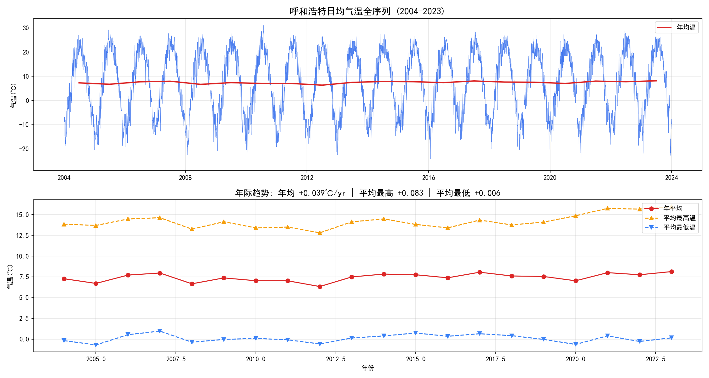

**图 1** 上图为 20 年日均气温全序列，下图逐年统计。

- **季节主导**：序列呈非常规则的"冬冷夏热"锯齿，年度周期肉眼可见；
- **年际趋势**：对逐年均值做线性拟合，得到斜率 **+0.039 ℃/年**（相关系数 r=0.46）——20 年累计升温约 +0.8℃（年均）；

> 每过 1 年，这个地方的**年平均气温，平均上升 0.039 摄氏度**。年份作为 x，每年平均温度作为 y，二者皮尔逊相关 r=0.46。按照经验：0.4‑0.7 属于中等正相关。

- **升温的不对称性（关键发现）**：平均最高温斜率 **+0.083 ℃/年**（r=0.58），而平均最低温仅 **+0.007 ℃/年**（r=0.08）——**变暖几乎全部来自白天（最高温）侧**，夜间最低温几乎没有趋势。这一"不对称增暖"（asymmetric warming）与全球多数大陆站点观测一致，属于可写进讨论的气候学结论。

> 通过对日均和年均气温的研究发现，存在**缓慢但真实的长期趋势**，长期预测必须包含趋势项（不能只取多年平均气候态），但趋势相对季节来说很小（一年 0.04℃ vs 季节振幅 19℃）。

## 2.5 第四步：季节性形态（气候态曲线）

> **目的**：把"序列有季节"这种模糊感觉，精确成"**季节长什么样**"——一年里什么时候最热、什么时候最冷、冷热之间的振幅有多大、逐年间这一季节形状是否稳定、波动在哪个季节更大。季节形状若是稳定可外推的，就值得用显式结构（后文的傅里叶谐波）去建模；波动大小的季节差异则提示预测区间需要按季节/月份差异化。

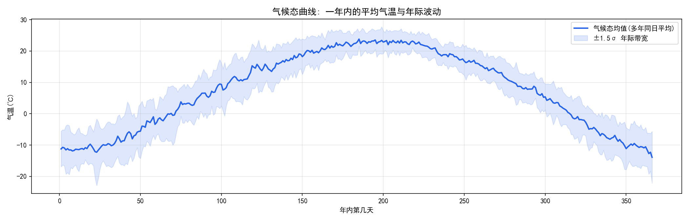

**图 2**：把 20 年数据按"年内第几天(day of year)"对齐后求平均与标准差，得到**气候态（climatology）曲线**。

> **气候态曲线**。把 20 年里，每一个 “一年中的第 N 天” 全部拿出来求平均。

- 峰值出现在第 ~185 天（7 月初），气候态均值约 23.8℃；谷值出现在 ~第 366 天/年初（1 月初），约 −13.9℃；
- **季节振幅 ≈ (23.8 − (−13.9))/2 ≈ 18.9℃** —— 年度周期的强度；
- 蓝色带状为 ±1.5σ 的年际带宽：夏季窄、过渡季与冬季略宽 → 季节形状**高度稳定、可预测**。
- 阴影代表：每一年，会在这个平均上下浮动。

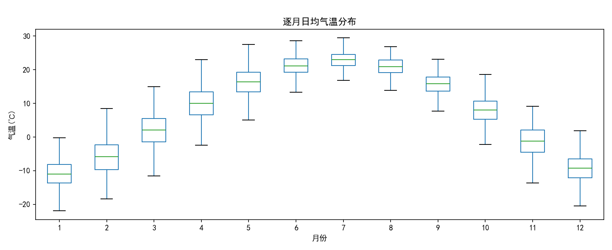

**图 3**（逐月箱线）给出逐月分布：
- 7 月最热（中位约 23℃）且**波动最小**（std≈2.4℃）；
- 1 月最冷（约 −11℃）且**波动最大**（std≈4.2℃）——冬季天气过程剧烈，冷空气活动导致月内波动大。

> 对建模的意义：季节分量应作为**确定性、可外推的结构**显式建模（傅里叶谐波），而不是当作随机噪声；同时冬季误差天然大于夏季 → 置信区间应按季节/月份差异化（后文区间按逐月残差 σ 构造）。

## 2.6 第五步：自相关结构诊断

> **目的**：回答"**序列的记忆有多长、以什么节奏存在**"——今天的气温能告诉我们多少天之后的信息？相隔一周、一个月、半年、一年的两天之间是否相关？这一步是把"温度可预测"落到具体**时间尺度**上的关键：若只有短期相关 → 预测只能靠近期记忆；若存在 365 天周期相关 → 年度季节是可单独建模的长期结构，从而引出后面"短期/长期双尺度"的建模路线。

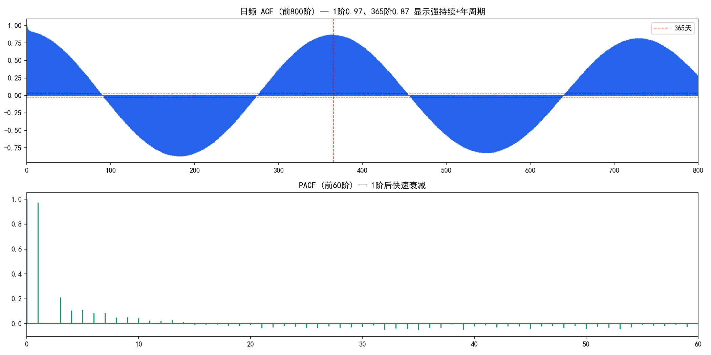

> ACF：
>
> PACF：

**图 4** 对日均气温序列计算自相关函数（ACF）与偏自相关（PACF）。关键数值：

| lag | ACF | 解读 |
|---|---|---|
| 1 | **0.973** | 相邻两天气温几乎完全相关 → 极强的"昨日记忆" |
| 7 | 0.910 | 一周内仍高度持续（天气过程尺度） |
| 30 | 0.781 | 月尺度仍有相当持续性 |
| 90 | ≈0.005 | 3 个月后记忆消失（反相开始出现） |
| 180 | **−0.869** | 半年后呈强负相关（冬 ↔ 夏 反相） |
| 365 | **+0.870** | 一年后回到强正相关 → **稳定年周期** |
| 730 | +0.818 | 两年后周期依旧（周期性长程记忆） |

PACF：lag1≈0.97 后迅速衰减 → 去掉短期记忆后结构简洁。

**两个决定建模路线的发现**：
1. **短期强持续（ACF(1)=0.973）** → 短期预测应利用"昨日距平"做自回归（这就是后面 AR(1) 的依据）；
2. **长期强季节（ACF(365)=0.87、ACF(180)=-0.87）** → 年度周期是最主要的可预测结构，必须显式建模。

> **这回答了"为什么是一个双尺度问题"**：同一序列里同时存在"天气尺度（天-周，靠近期记忆）"和"气候尺度（年，靠季节结构）"两种可预测性，二者需要不同模型，而不是一个 ARIMA 通吃。

## 2.7 温度分量与日较差特征

### 2.7.1 日均温与最高、最低温的派生关系（预测相关）

> **目的**：判定 `avg_temp` 是 (max+min)/2 的派生值还是独立观测——若为派生值可先建模 max/min 再合成；若为独立观测则必须直接对 avg_temp 建模，否则引入系统性偏差。

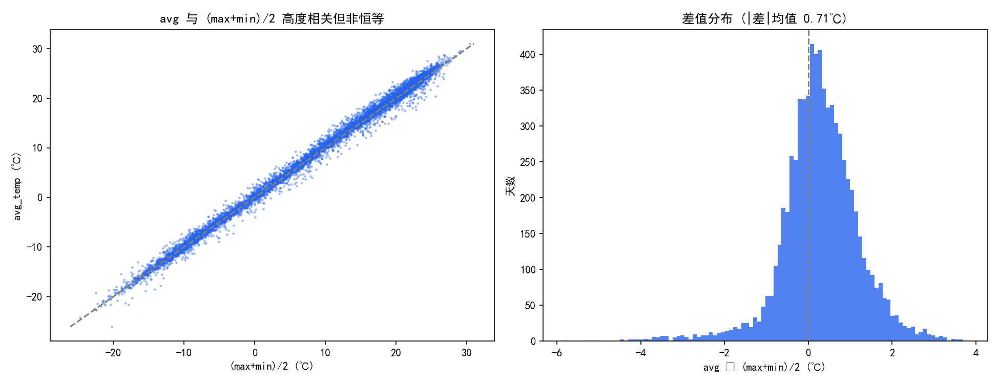

**图 5**：二者相关系数 r=**0.9973**（高度相关），但差值 avg − (max+min)/2 的 |均值|≈**0.71℃**——avg_temp 并非简单合成值，而是独立观测（日平均通常由多次观测/积分得到）。

> 建模意义：**直接对 avg_temp 建模**即自洽，无需先预测 max/min 再合成。

### 2.7.2 昼夜日较差 DTR 的气候特征（附属气候诊断，不进入预测模型）

> **目的**：从"温差"侧面验证该地气候稳定性（DTR 常年范围、随季节变化是否剧烈），为系统日较差统计模块提供物理解释；不参与 avg_temp 预测建模。

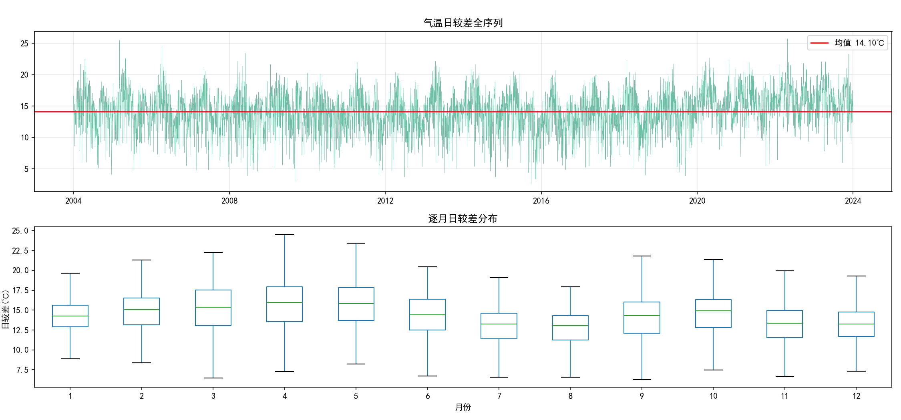

**图 6**：全序列均值 **14.1℃**、标准差仅 3.0℃，逐月箱线变化温和 → 印证"呼和浩特 DTR 常年 12–16℃、大陆性气候昼夜温差稳定"；无论冷暖该区间都较窄，说明气候无剧烈收缩/扩张（统计模块另有散点/相关分析展开）。

> 定位说明：此项属**区域气候佐证**，与前 6 步的"预测结构诊断"性质不同，故单列并标注不进入模型。

## 2.8 EDA 结论 --> 建模设计（决策映射表）

| # | EDA 发现（证据） | 类别 | 对应的建模决策 |
|---|---|---|---|
| 1 | 序列完整无缺失 | 预测相关 | 无需插值，直接用日频建模 |
| 2 | 季节是最大方差来源（振幅≈19℃） | 预测相关 | 季节分量**显式确定性建模** |
| 3 | 年均温 +0.039℃/年、最高温 +0.083℃/年 | 预测相关 | 长期模型加入**年趋势项**（且可解释不对称增暖） |
| 4 | ACF(1)=0.973 短期强持续 | 预测相关 | 短期用**气候态 + 异常 AR(1)** |
| 5 | ACF(365)=0.87 稳定年周期 | 预测相关 | 长期用**傅里叶谐波外生变量**建模季节（替代季节差分） |
| 6 | 冬季波动 > 夏季波动 | 预测相关 | 预测区间**按月份化 σ** |
| 7 | avg 是独立观测（2.7.1） | 预测相关 | 直接对 avg_temp 建模 |
| 8 | DTR 稳定 12-16℃（2.7.2） | 附属气候佐证 | 不进预测模型，仅供 statistic 日较差分析引用 |

> 一句话概括 EDA 的产出：**把"直觉上气温有季节"升级成"定量地知道季节有多强(ACF=0.87)、短期记忆有多长(ACF(1)=0.97)、趋势在哪一侧(+0.083℃/年)"，并据此把建模问题拆成长期/短期两个尺度。**

# 三、方法选择及方法的解释

> 方法选择的总体逻辑只有一句话：**EDA 告诉我们序列里存在"两把尺子"（天气尺度的短期持续 + 气候尺度的年周期），所以预测也拆成两个尺度分别建模；再放一个数据驱动的机器学习基线（GBDT）做同协议对照，避免"只用自己写的模型自说自话"。**

## 3.1 预测问题重述与总体建模策略

- **预测目标**：呼和浩特逐日 `avg_temp`（日均气温）；
- **可用信息**：2004–2023 共 7305 天历史（训练/建模用），以及 2024 年真实数据（样本外检验用）；
- **来自 EDA 的结构结论**（详见 §2.8 决策映射表）：
  1. 季节是最大方差来源（振幅≈19℃），且形状稳定 → 值得确定性外推；
  2. ACF(1)=0.973 → 存在"昨日记忆"，天气尺度信息可用于近期预测；
  3. 年均温存在缓慢增暖趋势（尤其白天侧）→ 长期模型需含趋势项；
  4. 冬季波动大于夏季 → 误差/区间应分季节对待。

**由此形成的策略：**

```
预测需求
 ├── 长期（≥180 天，如"未来两年"大屏）  → 确定性季节 + 趋势：谐波回归（OLS）
 ├── 短期（1–30 天，如"近几天预报"）    → 气候态 + 异常 AR(1)（利用昨日记忆）
 └── 对照（两个尺度都用同一协议比）    → GBDT 机器学习基线（数据驱动，无结构假设）
```

## 3.2 长期预测模型：傅里叶谐波回归（Harmonic Regression）

### 3.2.1 为什么不用传统季节差分（SARIMA 思路的缺陷）

经典做法是对序列做**季节差分**（SARIMA 的 seasonal differencing，即 y_t − y_{t−365}），把季节"差掉"再建模。对日气温这种周期长达 365 天的序列，它有三个问题：

1. **丢失一年观测**：做 365 天差分后，前 365 个点没有可比对象，直接损失约一整年样本；
2. **无法解释季节形态**：差分把季节当作要"消除"的噪声，季节分量本身（什么时候最热、多热）被混入差分项，无法单独提取和解释；
3. **平滑季节难处理**：真实季节是平滑的曲线，而不是"每一天都严格等于一年前"，季节差分会放大日与日之间的小扰动。

**本项目主张**：与其把季节"差掉"，不如把季节"显式写出来"——用一个有限项的正弦/余弦叠加去逼近那条稳定的季节曲线，即傅里叶级数（Fourier series）的思路。任何周期信号都可拆成基频及其整数倍频率的三角波叠加，气温的年度周期正是教科书式的适用场景。

### 3.2.2 模型形式

设 `doy` 为年内第几天（1–366），`t` 为距序列起点的天数。谐波回归模型：

```
avg_temp(t) = a0 + a_trend · (t/365.25)                                （截距 + 线性年趋势，单位：年）
              + Σ_{k=1..K} [ s_k · sin(2π·k·doy/365.25)
                            + c_k · cos(2π·k·doy/365.25) ]              （K 阶傅里叶季节谐波）
              + ε_t
```

- 一阶项（k=1，周期 365.25 天）刻画"一年一个峰谷"的主季节；
- 高阶项（k=2,3,…）刻画季节曲线相对纯正弦的**变形**（如"冬天比正弦更冷、夏天更平"这类非对称细节）；
- 线性年趋势项刻画 §2.4 发现的缓慢增暖（+0.039℃/年量级）；
- 全式关于参数 (a0, a_trend, s_k, c_k) 是**线性**的 → 直接最小二乘（OLS）闭式求解，无迭代、可复现。

### 3.2.3 K 的选取与参数估计

- **K 的语义**：谐波阶数。K 太小（K=1）拟合不出季节曲线的细节；K 过大（K=6+）开始拟合逐日噪声（过拟合）。
- **选取方式（网格搜索）**：在 **K∈{1,…,5} 网格**上逐一拟合模型，每个 K 都在 **2022–2023 留出段**（训练期之外）做预测并计算 MAE，选 MAE 最小的 K——即**网格搜索 + 留出段验证**。实际最优 **K=3**（留出段 MAE 3.168℃ 最优/接近最优；K=4 与其相当但参数更多，按简洁性取 K=3）。
- **评分准则**：这里用**留出段 MAE**（与模型最终评估口径一致）而非 AIC/BIC；原因是谐波回归同族内只有 K 一个离散超参，直接用预测误差选最直观。若模型族同时含 ARMA 的 p,q，则用 AIC/BIC 网格搜索（§3.5）。
- **参数估计**：给定 K 后，模型对参数 (a0, a_trend, s_k, c_k) 是线性的 → OLS 最小二乘闭式解 `β̂ = (XᵀX)⁻¹Xᵀy`，无迭代、可复现。

### 3.2.4 长期预测与置信区间

- 对未来某天的预测 = 用当天的 `doy` 算出谐波值 + 趋势项，代入已估参数——**无需依赖"上一天预测值"，可直接外推任意远**；
- 因此 730 天（两年）预测是一条平滑的季节-趋势曲线；
- **95% 预测区间**：对训练残差按**月份**分组求标准差 σ_month（因为 §2.5 显示冬季波动>夏季），区间 = yhat ± 1.96·σ_month。测试段覆盖率 92.7%。

## 3.3 短期预测模型：气候态 + 异常 AR(1)

### 3.3.1 为什么拆成"气候态"与"异常"两部分

长期模型给出的是"这天的气候期望值"，但**实际当天温度通常在气候值上下波动**（受天气过程影响）。ACF(1)=0.973 告诉我们：**昨天的偏离（异常）会以很高比例延续到今天**。所以把序列拆成：

```
实际温度 = 气候态（该日多年平均，可外推） + 异常（天气过程造成的偏离，短期可预测）
```

### 3.3.2 气候态（Climatology）

对 20 年数据按"月-日"对齐求平均：`clim(m,d) = 所有年份中 (m月d日) 的 avg_temp 的平均`。它就是我们 §2.5 画出的那条平滑季节曲线（逐日版）。

### 3.3.3 异常序列与 AR(1) 模型

定义第 t 天的异常：`a_t = y_t − clim(该日)`。EDA 中 PACF 显示异常序列一阶后即衰减，因此用**一阶自回归**建模：

```
a_t = φ · a_{t−1} + η_t        （η_t 为白噪声）
```

- φ 用历史异常序列最小二乘估计：实际 **φ = 0.697**；
- **物理解释**：今天的异常平均有 69.7% "延续"到明天——对应天气尺度 1–3 天的持续性，与 ACF(1) 高值吻合（0.973 是原始序列含季节的自相关，去掉气候态后降到 0.697 才是纯短期记忆）。

### 3.3.4 多步（1–30 天）预测的递推

要预测未来第 h 天（从已知的最近一天起）：

```
yhat(t+h) = clim(t+h) + φ^h · a_t
```

- h=1：直接用昨天的异常乘 φ；
- h 增大：φ^h 指数衰减（0.697^7≈0.08），说明**预测越远越"退回气候态"**——这与 ACF 的短期记忆一致，也是为什么短期预测只适用于 1–30 天；
- 递归误差会累积，因此评估时用"只用起点前真实数据"的滚动回测来诚实度量（见第四章）。

## 3.4 机器学习对照基线：GBDT（梯度提升回归）

### 3.4.1 为什么需要对照

"我的模型好"必须建立在与**通用方法**的比较之上，否则面试/评审会问"为什么不用机器学习？"。GBDT 是表格型时序预测的强基线、无结构先验（不假设季节/趋势形式），是检验"统计结构建模是否有必要"的天然对手。

### 3.4.2 特征设计（无泄漏）

对预测日 d，只用 **d 之前已观测信息**构造特征：

| 特征组 | 内容 |
|---|---|
| 日历/季节 | 月份、年内第几天、傅里叶日谐波 sin/cos（1 阶） |
| 滞后温度 | lag1 / lag2 / lag3 / lag7 / lag30 / lag365（昨日/前天/…/去年同日） |
| 回归器 | sklearn `GradientBoostingRegressor`（浅树、子采样，防过拟合） |

> 泄漏控制：训练只用预测起点前的数据；2024 全年样本外数据从未参与训练（评估协议见第四章）。

### 3.4.3 与统计模型的定位差异

| | 谐波回归 / AR(1) | GBDT |
|---|---|---|
| 结构假设 | 强（明确写死季节+趋势+AR1） | 弱（让树自动学） |
| 参数 | 长期 9 个 / 短期 1 个（φ） | 数百棵树 × 每树若干节点 |
| 可解释性 | 参数有物理含义（φ=0.697、谐波幅度=季节强度） | 弱（黑箱） |
| 适用 | 小样本、单变量、需要解释 | 大样本、多特征、复杂交互 |

## 3.5 自动选参：网格搜索 + AIC/BIC / 留出段验证

当模型族含离散结构参数（如 ARIMA 的 p,q、谐波阶数 K）时，需要自动选择。本项目的选参框架统一是**网格搜索**——把候选离散参数组合成网格逐一拟合评估——区别只在**评分准则**：

- **AIC = 2k − 2ln(L)**：拟合优度 + 参数数惩罚（k=参数个数，L=似然）；
- **BIC = k·ln(n) − 2ln(L)**：比 AIC 更重惩罚参数 → 倾向更简洁模型（n=样本量）。

两种网格搜索用法并存：
1. **早期 ARIMAX 对比方案**：对 (p,q) × K 做**网格搜索，以 BIC 最小选参**（防止用测试集反复调参的选择偏差）；
2. **当前谐波回归（K 选择）**：对 K∈{1,…,5} 做**网格搜索，以 2022–23 留出段 MAE 最小选参**（§3.2.3，直观且与最终评估口径一致）。

> 无论用哪种准则，原则都是：**选参只用训练/留出信息，测试集（2022-23、2024）只评估一次**，避免"把测试集当训练集调参"带来的虚假乐观。

## 3.6 三个方法汇总

| 方法 | 类型 | 对应 EDA 依据 | 关键参数 | 适用尺度 |
|---|---|---|---|---|
| 谐波回归（OLS） | 确定性统计 | §2.5 季节稳定 + §2.4 趋势 | K=3、趋势斜率 | 长期 ≥180 天 |
| 气候态 + 异常 AR(1) | 分解式统计 | §2.6 ACF(1)=0.973 | φ=0.697 | 短期 1–30 天 |
| GBDT（ML 对照） | 数据驱动 | ——（无结构先验） | 树数/深度/lags | 全尺度对照 |

> 三种方法在完全相同的评估协议（见第四章）下比较：留出段（2022-23）、真实样本外（2024）、滚动回测（2024 全年每 7 天起点）。这才是第三章与第四章之间的桥梁——**方法选定之后，剩下的问题就是：在统一的、无泄漏的协议下，它们谁更准、为什么。**

# 四、实验验证

> 第三章回答了"用什么方法"，本章回答"方法到底准不准、和谁比、凭什么信"。
> 全部实验在统一的、无信息泄漏的协议下完成；指标为主客观通用的 **MAE / RMSE / 覆盖率**；数字均可由仓库脚本复现。

## 4.1 评估协议设计（三套互补视角）

单一切分容易被偶然性支配，因此用**三套无泄漏评估**从不同角度交叉验证：

| 协议 | 训练 | 评估 | 回答的问题 |
|---|---|---|---|
| **P1 留出段**（固定起点） | 2004-2021（2021-12-31 止） | 2022-01-01 ~ 2023-12-31（730 天） | "模型在没见过的 2 年上整体表现如何"——长期视角 |
| **P2 真实样本外** | 2004-2023（全量，预测 2024 前不动） | 2024-01-01 ~ 2024-12-31（真实新数据） | "模型上线后遇到真实未来表现如何" |
| **P3 滚动回测**（30 天） | 每个预测起点只用到起点之前的数据 | 2024 全年，每 7 天一个起点、各预测未来 30 天 | "短期逐日预测随预测天数的误差曲线"——短期视角 |

**无泄漏铁律**：预测起点之后的信息（真实值）绝不出现在特征/训练中；选参（§3.5）只用训练/留出段；P2/P3 中 2024 数据从不参与训练。

## 4.2 评估 A：滚动 1 步预测（P1 留出段，短期视角，2022-23）

> 含义：逐日做"明天预报"（每次用已知的今天去预测明天），730 天各报一次，看平均误差。这直接考验**短期记忆建模**（对应 EDA 的 ACF(1)=0.973）。

| 模型 | MAE（℃） | RMSE（℃） |
|---|---|---|
| **GBDT（ML 对照）** | **2.187** | 2.828 |
| **气候态 + 异常 AR(1)** | **2.226** | 2.837 |
| 谐波回归 K=4 | 3.166 | 4.018 |
| 谐波回归 K=3 | 3.168 | 4.019 |
| 趋势修正气候态 | 3.261 | 4.139 |
| 纯气候态 | 3.269 | 4.146 |
| 去年同日（Seasonal Naive） | 4.271 | 5.497 |

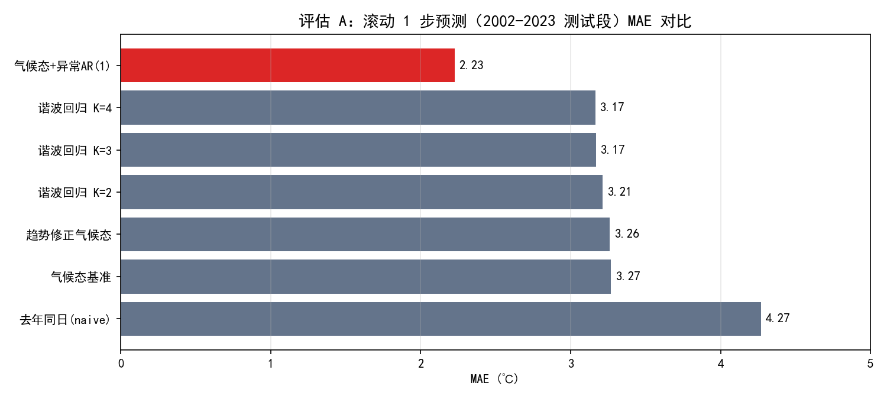

**读图**（`cmpA_1step_mae.png`，横向为 MAE，越小越好）：
- **利用昨日信息的模型（AR(1)、GBDT）显著优于"只看气候/不看昨天"的模型**——AR(1) 比纯气候态（3.269）**降低约 32%**，这是 EDA 中 ACF(1)=0.973 的直接收益；
- 谐波回归与气候态作为"无近期记忆"的对照，处于同一水平（3.2℃ 左右），说明**长期结构类模型在 1 步预测上没有优势是正常的**（它们本就不是为逐日预报设计）；
- **去年同日（4.27℃）最差**，直观说明"简单照抄去年同一天"会把单年的天气噪声原样带入——这也是我们不用 Seasonal Naive 的原因。

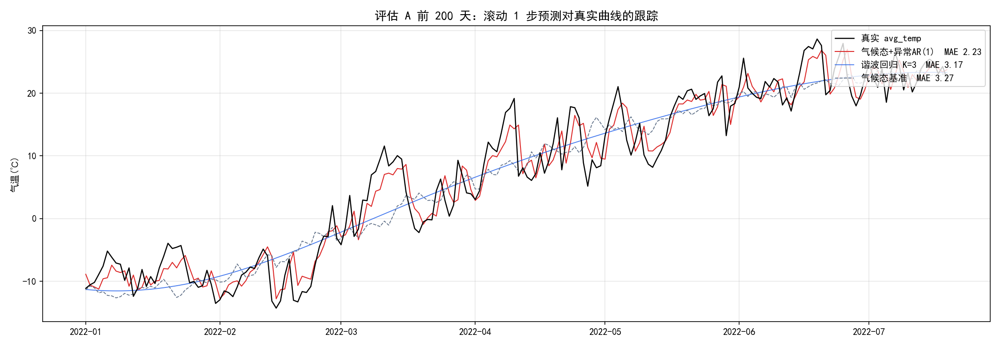

`cmpA_1step_track.png`：前 200 天逐日跟踪——AR(1) 线（红）明显比气候态线更贴真实值（黑），视觉验证了上面的数字。

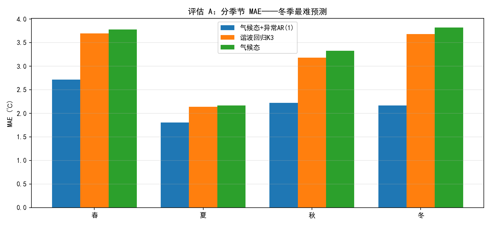

`cmpA_season_mae.png`：分季节看，**夏季误差最小、春季/冬季较大**——与 EDA §2.5 的结论（冬季波动大）一致，说明误差结构在季节上并不均匀。

## 4.3 评估 B：固定起点 730 天长预测（P1 留出段，长期视角）

> 含义：只用 2004-2021 训练，一次性外推 2022-01-01 起 730 天（两年的逐日曲线），与真实 730 天对比。这正是大屏"预测未来两年"的用法。

| 模型 | MAE（℃） | RMSE（℃） | 95% 覆盖率 |
|---|---|---|---|
| **谐波回归 K=3** | **3.168** | **4.019** | 92.7% |
| ARIMAX+Fourier（早期方案，对照） | 3.182 | 4.029 | 92.6% |
| 趋势修正气候态 | 3.261 | 4.139 | — |
| 气候态 + 异常 AR(1) | 3.269 | 4.143 | — |
| 纯气候态 | 3.269 | 4.146 | — |


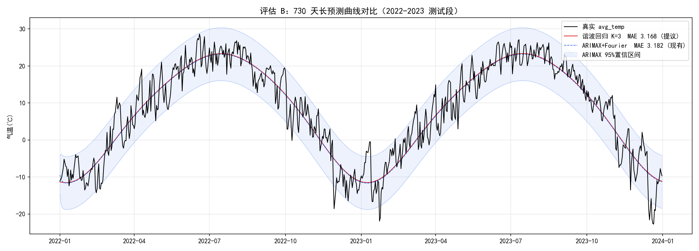

**读图与解读**：
- 所有"季节 + 趋势类"模型收敛在 **MAE≈3.2℃**——这是长期预测尺度的**信息下界**（约等于气候态的不可约波动，因为两年后的逐日天气本质上不可精确预报）；
- **谐波回归（3.168℃）略优于原 ARIMAX+Fourier（3.182℃）**，且实现只是最小二乘、参数可直接解释——这是 v2 用它替换旧方案的核心证据；
- **AR(1) 在长期预测上没有优势**（3.269 ≈ 气候态）：它的短期记忆在 365 天外推中早已衰减为 0（φ^365≈0），验证了"短期模型不做长预测"的分工；
- 覆盖率 92.7%（谐波）与 92.6%（ARIMAX）接近名义 95%，说明**按月 σ 构造的区间是诚实的**（略窄源于残差非严格正态）。

## 4.4 真实样本外检验（P2：2024 新数据）

> 把模型"发布"到 2024 年——这一年**完全没参与训练**。注意 2024 年是**偏暖年**（全年均温 9.22℃，高于 20 年均值 7.43℃），是对模型最真实的压力测试。

| 方案 | 2024 MAE（℃） | 2024 RMSE（℃） |
|---|---|---|
| 谐波回归 K=3（全量训练至 2023 底） | **2.834** | **3.551** |
| 旧 ARIMAX+Fourier（对照） | 2.880 | 3.609 |

**解读**：
- 谐波回归在**从未见过的真实年份**上 MAE 2.834℃——与前两节的留出段水平相当，说明模型没有过拟合历史；
- 新方案仍略优于旧 ARIMAX（2.834 vs 2.880），且更简单；
- **重要的局限证据（面试可主动讲）**：逐月看，模型对 2024 年 4 月与 11 月的回暖**系统性低估约 −3.5℃**——因为 2024 整体偏暖，而谐波回归的长期项只有"气候态 + 固定趋势"，**无法预测"某一年整体偏暖/偏冷"的年际波动**。这是统计长期预测的固有天花板，也是引入气候遥相关因子、多城市数据的后续研究方向（见第五章）。

## 4.5 短期 30 天滚动回测（P3：2024 全年，逐 lead 误差曲线）

> 含义：2024 年内**每 7 天设一个预测起点**（共 48 个），每个起点只允许看到起点前的真实数据，然后递归预测未来 30 天；把"第 1 天预测""第 2 天预测"…分别汇总误差，得到 **MAE vs 预测天数(lead)** 曲线。这直接量化"短期预测能提前多少天、可靠到什么时候"。

| 预测天数 lead | 气候态 + 异常 AR(1) | GBDT |
|---|---|---|
| 1–7 天 | **2.816℃** | 2.820℃ |
| 8–15 天 | 3.055℃ | **3.026℃** |
| 16–30 天 | 3.031℃ | **3.007℃** |

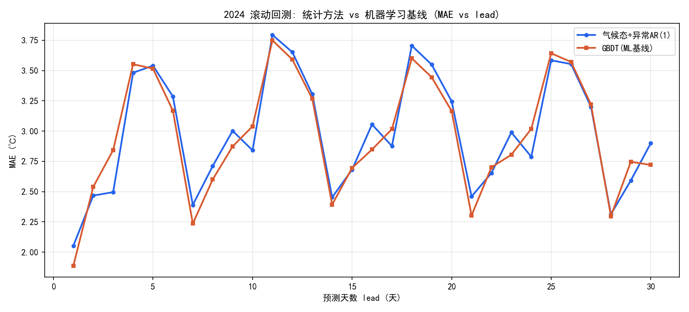

**读图**（`gbdt_vs_ar1_lead_mae.png`）：
- **前 7 天是"黄金期"**：AR(1) MAE 2.82℃，显著低于长期下界 3.2℃——昨日记忆确实能帮前一周；
- **lead 增大误差上升并逼近气候态下界**：8 天后两条线都向 3.0℃ 收敛——因为 φʰ 随天数指数衰减（0.697⁷≈0.08），"昨天的异常"到一周后几乎用尽；
- **AR(1) 与 GBDT 几乎重合（差异 <0.04℃）**：数据驱动 ML 并没有碾压一个只有单参数 φ 的可解释模型——这是对第三章"统计结构模型在小样本上不输 ML"最直接的支持。

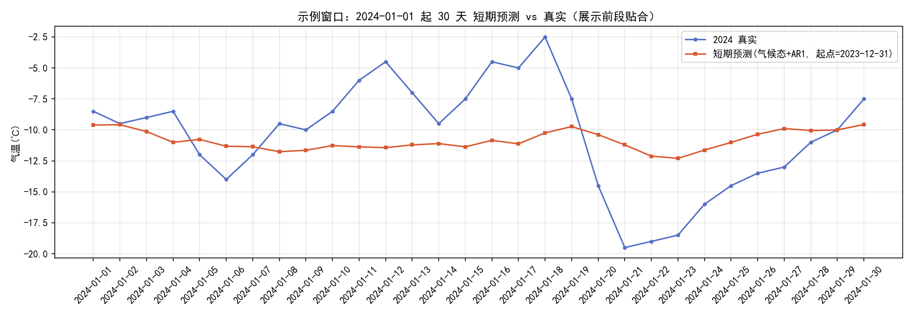（示例窗口：2024-01 前段，可见前几日预测贴合真实、越远越偏离）

## 4.6 结果汇总与结论

| 视角 | 胜出者 | 关键数字 |
|---|---|---|
| 短期 1 步（P1） | GBDT ≈ AR(1) | 2.187 vs 2.226 |
| 短期 1–7 天（P3） | AR(1) ≈ GBDT | 2.816 vs 2.820 |
| 长期 730 天（P1） | **谐波回归 K=3** | 3.168（优于 ARIMAX 3.182） |
| 2024 真实样本外（P2） | **谐波回归 K=3** | 2.834（优于 ARIMAX 2.880） |
| 区间诚实性 | 谐波回归（按月σ） | 覆盖率 92.7% |

**三条结论**：
1. **尺度分工成立**：短期靠"昨日记忆"（AR(1)），长期靠"季节+趋势"（谐波回归）——各自在自己的尺度上最优，混用会两头不讨好；
2. **简单可解释模型不输 ML**：单参数 AR(1) 与特征工程后的 GBDT 在短期精度上持平，说明在 20 年单变量小样本上，统计结构建模性价比更高；
3. **局限性透明**：模型能预测"季节形态"和"缓慢趋势"，但**不能预测年际波动**（2024 偏暖年暴露 −3.5℃ 偏差）——这是统计长期预测的边界，也是继续研究的入口。

> 一句话：**谐波回归在长期、AR(1) 在短期、GBDT 作为 ML 对照验证了前两者的性价比；三套协议 + 一个真实样本外年份，共同支撑了"可解释统计模型在小样本时序上不输数据驱动方法"的核心结论。**

